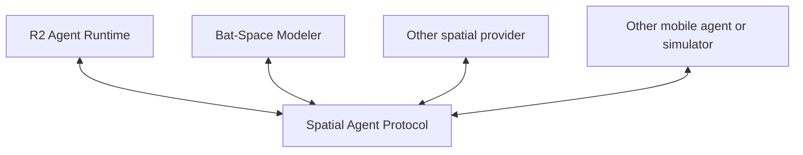

# R2 Runtime + Bat-Space Modeler Engineering Specification Pack

Specification version: **0.1.0**  
Status: **Development baseline**  
Prepared: **2026-08-11**

This pack is the source-of-truth handoff for building, simulating, testing, and deploying two independent products:

1. **R2 Agent Runtime** - a Raspberry Pi service that owns the BLE connection to a Sphero R2-D2 R201, supplies voice and character behavior, enforces movement safety, and maintains linguistic/semantic continuity.
2. **Bat-Space Modeler (BSM)** - a standalone acoustic spatial-computing system that coordinates microphone nodes and mobile acoustic probes to estimate room geometry and issue spatial advisories.

Their first required live integration is with each other. Neither system is allowed to depend on the other system's private code, database, process layout, or hardware implementation. They integrate only through the versioned **Spatial Agent Protocol (SAP)**. That same protocol lets R2 use another spatial provider later and lets BSM coordinate drones, droids, bots, or simulators.

## Start here

Read in this order:

1. [Product charter](docs/00-product-charter.md)
2. [System architecture](docs/01-system-architecture.md)
3. [R2 Agent Runtime specification](docs/02-r2-agent-runtime.md)
4. [Bat-Space Modeler specification](docs/03-bat-space-modeler.md)
5. [Spatial Agent Protocol](docs/04-spatial-agent-protocol.md)
6. [Safety, security, and privacy](docs/05-safety-security-privacy.md)
7. [Continuity and data](docs/06-continuity-and-data.md)
8. [Simulation and test plan](docs/07-simulation-and-test-plan.md)
9. [Deployment and operations](docs/08-deployment-and-operations.md)
10. [Roadmap and acceptance gates](docs/09-roadmap-and-acceptance.md)
11. [Hardware/software baseline](docs/10-hardware-software-baseline.md)
12. [Supplied-source assessment](docs/11-supplied-source-assessment.md)
13. [Open questions and risk register](docs/12-open-questions-and-risk-register.md)
14. [Glossary](docs/13-glossary.md)

For Codex, place [AGENTS.md](AGENTS.md) at the repository root and begin with [MASTER_CODEX_PROMPT.md](prompts/MASTER_CODEX_PROMPT.md). The phase and release prompts are reusable follow-ups.

When starting the implementation repository, copy [STATUS_TEMPLATE.md](STATUS_TEMPLATE.md) to root as `STATUS.md`, place this specification directory at `specs/`, and keep the contract files under version control.

## Mandatory architecture



The diagram is a contract relationship, not a shared runtime. SAP is a set of versioned schemas, behaviors, and conformance tests.

## Repository model

The recommended incubation layout is one workspace containing independently buildable projects:

```text
sphero-droids/
  AGENTS.md
  specs/                       # this pack; normative documentation
  protocol/                    # schemas, generated clients, conformance tests
  r2-runtime/                  # Raspberry Pi deployable; no BSM imports
  bat-space-modeler/           # PC/laptop deployable; no R2 imports
  integration-lab/             # compose files, simulators, record/replay fixtures
```

The projects may begin in one Git repository for development convenience, but CI must enforce the same dependency boundaries as separate repositories. Each deployable must build and pass its standalone test suite with the other deployable absent. The protocol can later be published and the projects split without changing product code.

## Normative language

The words **MUST**, **MUST NOT**, **SHOULD**, **SHOULD NOT**, and **MAY** indicate requirement strength. Requirements are traceable in [requirements.csv](traceability/requirements.csv).

When documents disagree, authority is:

1. Physical safety rules and the R2-D2 manual
2. Accepted architecture decision records
3. Spatial Agent Protocol schemas and protocol specification
4. Product specifications
5. Roadmap and implementation notes
6. Examples

## Verified hardware baseline

The supplied R2-D2 manual requires visible operation, approximately one meter of separation from people, and operation/storage between 0 and 40 degrees Celsius. The R201 uses a wired USB charging connection; a stock unit cannot physically plug itself in. The supplied `spherov2.py` 0.12.1 source exposes R2-D2-specific drive, pose-related sensors, collision events, battery state, head/leg movement, eight LED channels, 388 enumerated onboard audio identifiers (including shared/other-droid families), and 51 R2 animation identifiers. All advertised features remain **unverified on the user's individual firmware** until the Phase 1 hardware capability probe passes.

## How to use this pack with Codex

Codex automatically reads repository `AGENTS.md` instructions and layers more specific files from subdirectories. Keep durable constraints in `AGENTS.md`; give the current milestone in the task prompt. This follows the official [AGENTS.md guidance](https://learn.chatgpt.com/docs/agent-configuration/agents-md) and [Codex prompting guidance](https://developers.openai.com/cookbook/examples/gpt-5/codex_prompting_guide).

Do not ask Codex to build the entire program in one unreviewed pass. Use the master prompt once, then advance through the acceptance-gated milestones. Real motor tests are always an explicit, supervised action; simulation is the default.
