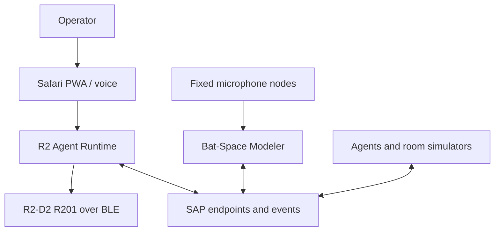

# 01 - System architecture

## 1. Architectural objective

The architecture must allow one-person MVP development without creating a permanent coupling between the robot and the spatial research system. Logical boundaries are therefore stricter than the initial source-code layout.

The system is divided into four bounded contexts:

| Context | Owns | Does not own |
|---|---|---|
| R2 Agent Runtime | BLE session, R2 command serialization, safety, behavior, voice, R2 expression, local continuity, operator UI | Acoustic reconstruction, BSM map storage, direct email actions |
| Bat-Space Modeler | Microphone nodes, calibration, acoustic evidence, localization/mapping, generic missions, map revisions, spatial advisories | R2 BLE, R2 personality, motor authorization, R2 continuity DB |
| Spatial Agent Protocol | Public messages, endpoint behavior, units, time/frame semantics, compatibility and conformance fixtures | Product implementations or shared persistence |
| Integration Lab | Simulators, deterministic scenarios, record/replay, end-to-end test orchestration | Production authority or product business logic |

## 2. System context

SAP is conceptual in this diagram. In the first implementation, each product hosts its own HTTP API and event stream and uses generated SAP clients. A central broker is not required.

## 3. Runtime topology

### 3.1 R2 Agent Runtime on Raspberry Pi

The reference deployment uses host-native services because BLE, audio devices, GPIO, and `systemd` supervision are simpler and safer outside containers.

| Service | Responsibility | Failure effect |
|---|---|---|
| `r2-ble` | Sole BLE connection owner; serialized commands; raw telemetry; reconnect | Motion stops; API remains diagnostic |
| `r2-core` | Safety executive, modes, command arbitration, SAP Agent API, continuity writes | Watchdog commands `r2-ble` to stop; service restarts |
| `r2-audio` | Microphone capture, wake word, VAD, critical local phrases, STT adapter | Web/manual control remains available |
| `r2-worker` | Optional smolagents dispatcher, expression planning, summaries, integrations | Deterministic commands and safety remain available |
| `r2-web` | PWA assets or API frontend behind existing Apache | Voice/local stop and core remain available |

These may begin as fewer processes, but `DroidDriver`, safety arbitration, and optional reasoning must remain separate modules. The BLE connection must have exactly one owner.

### 3.2 Bat-Space Modeler on PC/laptop

| Component | Responsibility | Scaling model |
|---|---|---|
| BSM API | SAP Spatial Provider API, enrollment, map/artifact query | Single instance initially |
| Mission coordinator | Generic agent capability negotiation and mapping mission state | Single leader per mission |
| Ingest/calibration | Recording validation, clock quality, channel calibration | Per-node workers |
| Signal pipeline | Probe matching, deconvolution, impulse responses, feature extraction | Process pool/GPU optional |
| Estimator | Source/mic localization, transforms, surface hypotheses, uncertainty | Batch or incremental jobs |
| World model | Immutable map revisions, entities, evidence links | Transactional metadata plus artifact store |
| Advisory engine | Localization, hazard, corridor, route proposals | Stateless from a map revision |
| Simulator | Rooms, arrays, clocks, probes, noise, agent motion, ground truth | Local/CI batch |

BSM core services may use containers, but low-latency microphone capture nodes should run natively on their host device.

## 4. Public integration surfaces

### 4.1 Agent surface, implemented by R2 and future mobile agents

- capability discovery;
- health and readiness;
- integration-session negotiation;
- high-level, bounded commands;
- command status and cancellation;
- pose, motion, health, collision/stuck, and probe-emission events;
- transform and clock-quality evidence;
- artifact references where applicable.

### 4.2 Spatial Provider surface, implemented by BSM and future providers

- capability discovery;
- session negotiation;
- observations and agent metadata ingestion;
- localization estimates and transform updates;
- map revision and feature queries;
- hazard and route advisories;
- evidence/artifact references;
- provider health and confidence state.

### 4.3 Transport profile

The required MVP transport profile is:

- HTTPS/HTTP 1.1 or HTTP/2 with JSON for commands and queries;
- Server-Sent Events (SSE) for ordered resumable event delivery;
- multipart HTTPS for bounded artifact/recording upload;
- SHA-256 content hashes for artifact integrity;
- bearer tokens on a trusted LAN for development, with mTLS support before broader network exposure.

The SAP domain model is transport-neutral. MQTT, NATS, WebSocket, ROS 2, or another transport may be added through adapters without changing payload semantics. Transport arrival time is never treated as sensor measurement time.

## 5. Authority and preemption

R2 Runtime arbitrates all requested actions in this order, highest first:

1. Physical or local emergency stop
2. Local safety interlock and watchdog
3. Critical battery, unsafe tilt, BLE fault, or operator-defined geofence
4. Authenticated manual operator control
5. Active supervised mapping/patrol mission within its lease
6. Spatial hazard and speed-cap advisory
7. Deterministic voice command
8. Conversational agent tool request
9. Discovery/idle behavior

Higher-priority work can cancel or suspend lower-priority work. A route advisory can narrow or reject a requested motion but cannot force it. A model-generated request is treated as untrusted input until schema, policy, and safety validation succeed.

## 6. Control leases

Every motion-producing mode operates under a short-lived lease issued by `r2-core`. A lease binds:

- controller identity and authenticated session;
- permitted command classes;
- speed, distance, time, and geofence limits;
- expiry and heartbeat interval;
- safety configuration version;
- mission/correlation ID.

The BLE owner must stop on lease expiry even if the requesting process is hung. Non-motion expressions may use a separate, less restrictive lease but still obey temperature, battery, stance, and command-rate limits.

## 7. Time architecture

Acoustic mapping requires explicit timing quality. Each producer records:

- `occurred_at`: RFC 3339 UTC wall-clock timestamp;
- `monotonic_ns`: local monotonic time since boot/session origin;
- `clock_id`: identity of the clock domain;
- synchronization source: none, NTP, PTP, shared audio interface, measured offset, or simulation;
- offset/drift estimate and uncertainty;
- sample index and sample rate for audio evidence.

BSM may use evidence only at a precision justified by its clock uncertainty. Browser/network receipt timestamps are suitable for coarse sequencing, not precise ranging.

## 8. Spatial architecture

Public geometry uses a right-handed coordinate system and SI units. Required frames are:

- `world`: stable provider-owned room frame;
- `map/<revision>`: geometry for an immutable map revision;
- `odom/<agent_id>`: locally continuous but drifting agent frame;
- `base_link/<agent_id>`: agent body frame;
- `probe/<source_id>`: acoustic source origin;
- `mic/<node_id>/<channel_id>`: microphone acoustic center.

Transforms form a time-indexed graph. Every transform includes source, confidence, covariance/uncertainty, validity interval, and clock evidence. R2's relative locator data begins in `odom`; only BSM or another localization provider may estimate `world -> odom`.

The data model is six-degree-of-freedom from the first commit. A floor-only R2 reports constrained `z`, roll, and pitch plus uncertainty; it does not introduce a separate 2D protocol that would later block drones.

## 9. Persistence boundaries

- R2 owns its append-only continuity events, command audit, semantic entities, user preferences, and local derived views.
- BSM owns recordings, calibration, acoustic features, transforms, geometry, map revisions, and advisory evidence.
- Cross-system messages and artifact hashes may be retained by both systems as receipts.
- Neither product performs joins against the other's database.
- Deletion/retention requests are applied independently and recorded as tombstone events where auditability is required.

## 10. Graceful degradation

| Loss | R2 behavior | BSM behavior |
|---|---|---|
| Internet/cloud model | Local stop/status/manual/Discovery subset continues; conversational features degrade | Local simulation/mapping continues if dependencies are local |
| BSM | Cancel mapping mission safely; retain local odometry/tags; use NullSpatialProvider | Marks agent disconnected; retains incomplete mission evidence |
| R2 | Safe stop if connected; operator alert | Continues with simulators/other agents; R2 mission pauses/fails |
| Microphone node | Exclude channel; recompute geometry/uncertainty; do not hide reduced observability | N/A except advisory confidence may fall |
| BLE | Stop command attempt, bounded reconnect, no inferred success | Agent becomes unavailable |
| Continuity DB | Physical control stays safe; new semantic writes fail visibly | Independent |
| Wall clock sync | Continue local sequence using monotonic time | Downgrade or reject ranging precision |
| PWA | Voice/local physical stop remain | API remains available |

## 11. Quality attributes

### Safety

- Local stop path P95 target: 300 ms from accepted local stop event to BLE stop dispatch under normal load.
- Network/manual stop P95 target: 500 ms on the trusted LAN.
- Motion halts within the configured lease expiry even when the controller process disappears.

These are software dispatch targets, not guaranteed physical stopping distance. Physical calibration supplies braking distance and becomes part of the safety envelope.

### Availability

- R2 core and BLE service target 8-hour supervised soak without uncaught failure for MVP.
- Automatic reconnect is bounded and observable; it never resumes prior movement automatically.
- Event producers use durable local queues where losing an audit event would matter.

### Performance

- Deterministic commands must not wait for an LLM.
- Pi CPU/memory budgets reserve capacity for stop handling and BLE even during STT.
- BSM processing may be asynchronous; every estimate declares the map revision and evidence window used.

### Portability

- R2 reference target: Raspberry Pi 4B, 4 GB, 64-bit Raspberry Pi OS or compatible Debian-based Linux.
- Reduced R2 profile: Pi 3B+ with reasoning/STT offloaded.
- BSM: Linux, Windows, or macOS core; native node applications per microphone host.

### Observability

All services emit structured logs, health/readiness, metrics, build/protocol versions, and correlation IDs. Sensitive transcript, email, and raw-audio content is excluded from default logs.

## 12. Architectural conformance tests

CI must prove:

1. `r2-runtime` builds/tests with BSM source absent.
2. BSM builds/tests with R2 source absent.
3. Only protocol-generated packages cross dependency boundaries.
4. SimR2 passes the Agent conformance suite.
5. SimSpatialProvider passes the Spatial Provider conformance suite.
6. R2 can switch between NullSpatialProvider and SimSpatialProvider by configuration.
7. BSM can switch between SimMobileAgent and R2's SAP endpoint by configuration.
8. Recorded events replay without using transport receipt time as measurement time.

