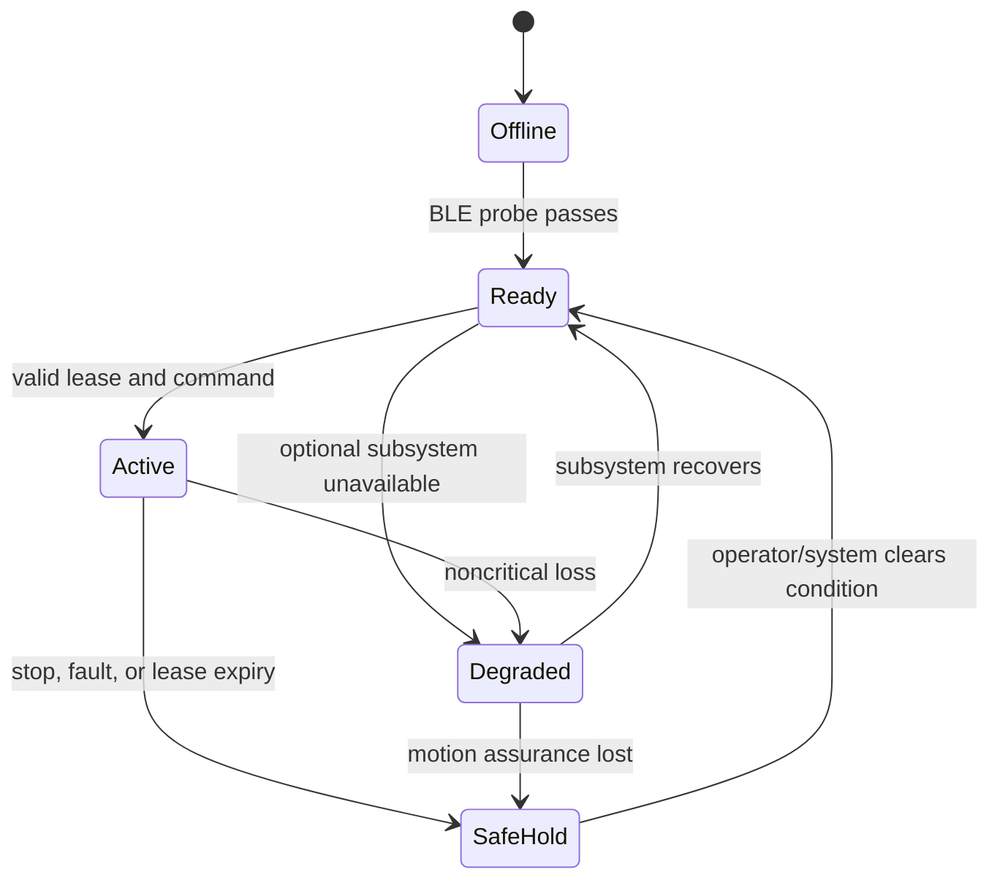

# 02 - R2 Agent Runtime specification

## 1. Purpose and operating envelope

R2 Agent Runtime is the authoritative software for one Sphero R2-D2 R201 connected over BLE to one Raspberry Pi. It provides safe control, expressive behavior, voice interaction, semantic continuity, and a generic SAP mobile-agent endpoint.

The initial reference target is the user's Raspberry Pi 4 Model B Rev 1.2 with 4 GB RAM and existing LAMP stack. Apache remains the TLS/reverse-proxy entry point. R2 services are Python applications supervised by `systemd`.

The R201 manual's physical restrictions are requirements, including visible supervised operation, approximately one meter of separation from people, a 0-40 C operating/storage range, inspection for damage, and cautious charging. Autonomous operation outside this envelope is unsupported.

## 2. Functional components

### 2.1 Droid Driver

`DroidDriver` is the only interface allowed to communicate with droid hardware. Required implementations:

- `Spherov2R2Driver`: persistent BLE adapter using a pinned, reviewed `spherov2.py` baseline/fork;
- `SimDroidDriver`: deterministic simulated sensors, command timing, faults, and expression history;
- `ReplayDroidDriver`: optional playback of a recorded hardware session.

The driver must:

- discover by configured identity/name, never a source-committed MAC address;
- connect once and serialize commands at a safe rate;
- expose connection lifecycle and firmware/capability probe results;
- implement stop, bounded movement, heading, stance/head/leg operations, LEDs, audio, and animation where verified;
- stream timestamped sensors and collision/power events;
- stop and invalidate motion state on disconnect;
- reconnect with exponential backoff but never resume movement;
- record raw library errors without leaking secrets;
- allow capabilities to be disabled when a firmware test fails.

The supplied `spherov2.py` source advertises eight R2 LED channels, 388 enumerated onboard audio IDs (the enum also contains shared/other-droid families), 51 R2 animation IDs, drive control, locator/velocity, attitude, acceleration, gyroscope, collision detection, battery voltage/state, head angle, and leg/head commands. Only a verified R2-appropriate subset may enter the expression lexicon. Each capability begins in `unverified` state until the hardware probe exercises it safely.

### 2.2 BLE owner

Only `r2-ble` may instantiate the BLE library. Other modules use a local typed IPC interface. The owner maintains:

- connection state machine: `offline -> scanning -> connecting -> probing -> ready -> degraded -> disconnecting`;
- one command queue with priority and cancellation;
- command-rate limiting;
- active motion lease and last safe stop;
- raw telemetry subscription registry;
- watchdog independent of web/agent work;
- bounded shutdown that attempts a stop before disconnect.

### 2.3 Safety executive

The deterministic safety executive validates every action against:

- system mode and controller authority;
- motion lease, deadline, idempotency, and freshness;
- calibrated speed/distance/turn limits;
- person keep-out and configured geofence;
- battery and BLE readiness;
- stance, tilt/fall, and recent collision/stuck state;
- current spatial-advisory confidence and validity;
- maximum blind movement segment;
- operator quiet hours and acoustic probe limits.

It may accept, modify, queue, reject, cancel, or preempt a request. The result and reason code are events. Reason codes are stable public identifiers, not only free text.

### 2.4 Command model

Required high-level actions are:

- `stop` / `safe_hold`;
- `move_relative(distance_m, heading_rad, speed_mps)`;
- `rotate_to(yaw_rad, angular_speed_rps)`;
- `navigate_to(target_pose, tolerances)` when a validated route provider exists;
- `hold_pose(duration_s)`;
- `set_mode(manual|discovery|patrol|mapping|attention|charging_staging|safe_hold)`;
- `emit_acoustic_probe(waveform_id, gain, repetitions, interval)`;
- `look_toward(speaker_zone|bearing)`;
- `express(semantic_expression)`;
- `play_verified_animation` for diagnostics/operator use.

Raw motor or arbitrary packet commands are diagnostic-only, disabled in normal profiles, and never exposed to conversational tools or BSM.

### 2.5 Telemetry and derived state

R2 emits raw and derived signals with separate provenance:

| Signal | Source | Notes |
|---|---|---|
| BLE connection | Driver | Authoritative for link state |
| Battery voltage/state | R2 API | Verify firmware behavior; do not invent percentage without calibration |
| Pose in `odom` | R2 locator/attitude | Relative and drifting; never world truth |
| Velocity | R2 telemetry | Used with commands for stuck inference |
| Acceleration/gyro | R2 telemetry | Used for tilt, fall, impact, motion quality |
| Collision | R2 notification | Detection after/at contact, not prevention |
| Stuck suspicion | Runtime inference | Commanded motion plus low displacement/velocity, collision, or current pattern if available |
| Pi health | Linux | CPU temperature, load, memory, disk, network, process state |
| Ambient temperature | Optional external sensor | Not conflated with Pi CPU or undocumented R2 telemetry |

Derived state always records algorithm version, evidence window, confidence, and thresholds.

## 3. R2 expressive language

### 3.1 Semantic expression input

All callers request meaning, never media IDs:

```json
{
  "speech_act": "warn",
  "meaning": "battery_low",
  "emotion": "concern",
  "urgency": 2,
  "attention_target": "operator",
  "motion_allowed": false,
  "phone_text": "R2-D2 battery is low"
}
```

### 3.2 Deterministic expression compiler

The compiler maps semantic input plus current state to a bounded combination of:

- verified onboard audio ID;
- animation or individual head/leg action;
- front/back RGB, logic display, and holo-projector LEDs;
- optional small locomotion gesture when explicitly permitted;
- optional text notification for meanings that R2 language alone cannot communicate precisely.

It must avoid rapid repetition, respect quiet mode, prevent conflicting animation/motion, and record the chosen media/actions. The LLM may select semantic intent; only the compiler selects executable expression primitives.

### 3.3 Expression lexicon

The MVP lexicon includes at least:

- greeting/attention;
- understood/yes/no/uncertain;
- success/relief/excitement;
- concern/warning/alarm;
- curiosity/search/thinking;
- frustration/stuck/collision;
- low battery/critical battery;
- disconnected/reconnected;
- listening/speaking/quiet mode;
- patrol/discovery/mapping start, pause, complete, and failure.

Lexicon entries are operator-previewable and hardware-tested at safe volume before automation.

## 4. Voice and conversation

### 4.1 Audio pipeline

```text
microphone -> noise gate/VAD -> wake word -> open session -> speech-to-text
           -> deterministic intent router -> optional reasoning dispatcher
           -> validated tool request -> safety/behavior -> R2 expression
```

The reference wake-word adapter is openWakeWord or another benchmarked engine. The primary phrase is **"Hey R2"**. **"R2-D2"** is secondary. The short phrase **"R2"** is accepted only during an already-open session unless testing proves an acceptable false-trigger rate.

The reference local STT adapter is quantized `whisper.cpp`, beginning with `tiny.en` and benchmarked against `base.en`. A remote or LAN-hosted STT implementation may replace it. R2 control cannot assume either meets latency on Pi until measured under simultaneous BLE/audio load.

### 4.2 Deterministic intents

These intents bypass the reasoning model:

- stop/freeze/hold;
- status/battery/connection;
- quiet/listen;
- cancel current action;
- manual directional commands with explicit bounded parameters;
- acknowledge/confirm/deny when a confirmation is pending.

Critical phrases use a constrained grammar or keyword detector after wake/session activation. Emergency stop also exists in the PWA and optional GPIO button.

### 4.3 Reasoning dispatcher

`smolagents.ToolCallingAgent` is the preferred initial adapter for ambiguous conversation and high-level tool selection because it emits structured tool calls. It is behind the owned `ReasoningDispatcher` interface because its API and model providers may change.

Allowed tools expose high-level behavior only. The dispatcher receives current mode, concise continuity context, capability state, and safety constraints. It cannot access raw BLE, secrets, email bodies by default, arbitrary shell execution, or unrestricted URLs.

Conversation sessions have explicit start/end, inactivity timeout, interruption handling, and summaries. A response that cannot be safely grounded becomes a clarification or refusal, not an inferred physical action.

## 5. Speaker Attention

The initial multi-microphone function is coarse attention, not mapping. Each node reports voice-activity interval, node/zone identity, energy, bearing if the node is an array, and confidence. The attention resolver:

1. correlates reports within a time window;
2. selects a speaker zone or bearing;
3. suppresses R2's own playback/probe interval;
4. requests a head turn or bounded body turn;
5. records the attention target and confidence.

It does not identify a person, calculate a navigation route, or feed raw measurements into BSM unless the microphone node independently supports the BSM recording protocol and consent policy.

## 6. Discovery / Explore and Learn

Discovery aims to resemble the stock Star Wars Droids application's characterful wandering without copying proprietary application code.

The behavior tree must:

- choose short, low-speed, bounded motion segments;
- pause and scan between segments;
- vary head, LEDs, sounds, and curiosity expressions;
- invite conversation/tagging after an encounter;
- record pose, recent motion, collision/stuck, and expression context;
- honor geofences, leases, quiet mode, battery, and operator interruption;
- recover from a minor encounter through stop, retreat/turn only when safe, and a semantic event;
- end in safe hold on repeated collision, localization loss, or uncertainty.

Discovery does not claim collision prevention during the R2 MVP. It is supervised and uses conservative segments until a spatial provider passes its real-room safety gate.

## 7. Patrol

Patrol is distinct from Discovery. It follows a versioned route containing poses, tolerances, speed caps, expected features, and safe abort points. A route must be validated manually or by an accepted provider before activation. Deviations or stale localization pause the route; they do not trigger speculative correction.

## 8. Talk-to-Tag

Talk-to-Tag links ordinary language to the current context. Candidate referents are ranked in this order:

1. explicitly pointed/selected UI object;
2. most recent unresolved encounter or observation;
3. current attention target;
4. current pose/nearby waypoint;
5. recently discussed entity.

For "That's the edge of the carpet," the system creates or updates a semantic entity and links:

- canonical label and aliases;
- transcript span and speaker/session identity if available;
- current and recent R2 pose evidence;
- collision/stuck/attention events;
- provider map feature ID when available;
- confidence, provenance, and revision history.

Ambiguous referents require confirmation. Tags can exist before BSM geometry; later map evidence attaches to the same stable entity rather than replacing it.

## 9. Spatial Provider client

From the first scaffold, R2 uses only `SpatialProviderClient`. Required implementations:

- `NullSpatialProviderClient`: reports no external localization/advisory;
- `SimSpatialProviderClient`: deterministic test estimates/faults;
- `SapSpatialProviderClient`: protocol client for BSM or another provider.

The R2 core treats provider messages as time-bounded, confidence-bearing advisories. It rejects stale frames, incompatible units/versions, unknown map revisions, impossible jumps, and estimates whose uncertainty exceeds the active mode's threshold.

## 10. Web/PWA

The Safari-compatible PWA provides:

- connection, battery, health, active mode, lease, and safety state;
- large emergency stop and safe hold controls;
- bounded manual joystick/buttons with deadman behavior;
- expression preview and diagnostics;
- Discovery, patrol, and mapping mission status;
- transcript/session view with microphone privacy state;
- tags, entities, event timeline, and map/artifact links;
- capability probe and calibration status;
- notification preferences and quiet hours.

It uses HTTPS. An iPhone PWA is not treated as a reliable permanent background microphone. Push-to-talk is supported when foregrounded.

## 11. Information integrations

Email/news/status sources publish sanitized `information.observed` events. Email is read-only OAuth with minimal scopes. Sender, subject, and preview are untrusted strings and cannot invoke tools. Classification runs in an isolated worker with no motor capability.

"Show me that email" resolves an already-known message reference and sends or displays a short-lived authenticated link through a configured notification sink. Sending email, deleting messages, or following links is outside MVP.

## 12. R2 states

The top-level behavior state machine is:



Nested modes do not bypass this state. On process restart, the system starts `Offline`/`SafeHold`; it never restores an active movement command.

## 13. Configuration

Configuration is typed and layered:

1. safe built-in defaults;
2. version-controlled non-secret site config;
3. device-specific config;
4. secrets injected by environment/credential store;
5. temporary operator session overrides within safe limits.

Key configuration includes droid identity, enabled driver, speed/distance caps, keep-out/geofence, wake phrases, audio devices, quiet hours, provider URL/identity, storage/retention, and notification adapters. Startup prints effective non-secret config and its hash.

## 14. R2-specific acceptance summary

R2 MVP requires:

- 30-minute persistent BLE session and 8-hour supervised service soak;
- capability probe report for the actual R201 firmware;
- deterministic local stop under load and lease-expiry stop tests;
- no motion in CI or without explicit hardware-test flag;
- simulator parity for public commands/events and injected faults;
- continuity survives restart and Talk-to-Tag resolves recorded scenarios;
- BSM absent: standalone R2 operation passes;
- SimSpatialProvider: mapping-session contract flow passes;
- smolagents, STT, wake word, internet, and email absent: stop/status/manual core still passes.

Detailed thresholds and phase gates are in [09-roadmap-and-acceptance.md](09-roadmap-and-acceptance.md).
