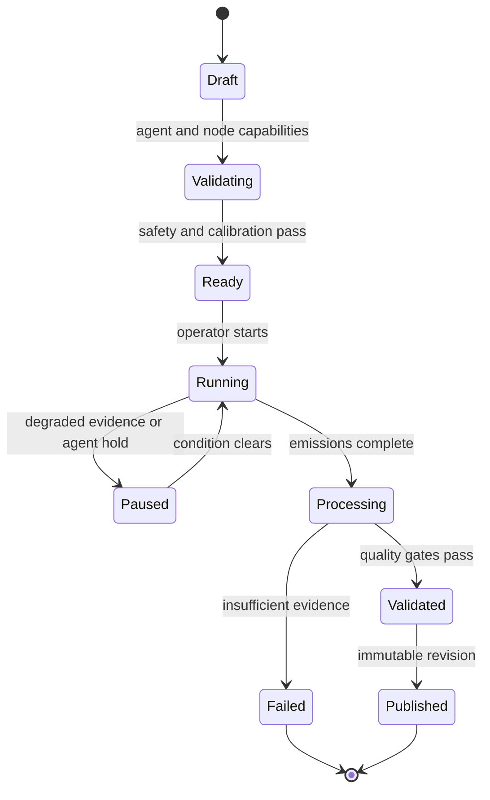

# 03 - Bat-Space Modeler specification

## 1. Purpose

Bat-Space Modeler (BSM) is a standalone system for active acoustic localization and spatial modeling. It coordinates probe emitters, fixed microphone channels, calibration evidence, and mobile-agent observations to build a revisioned 3D world model with explicit uncertainty.

R2 is BSM's first physical mobile probe, not its internal abstraction. All mission logic targets SAP `MobileAgent` capabilities. R2-specific command translation remains inside the R2 Runtime.

## 2. Scientific claim boundary

BSM is an experimental measurement system, not a guaranteed collision-avoidance sensor or survey instrument. Its releases must distinguish:

- **simulation result:** evaluated against synthetic ground truth;
- **bench result:** calibrated stationary source/array in controlled geometry;
- **real-room result:** measured against independent room/reference measurements;
- **operational advisory:** safe enough for a specified agent/mode envelope;
- **research hypothesis:** not yet validated.

No simulated accuracy number may be presented as real-room performance. Every estimate contains uncertainty and evidence provenance.

## 3. Generic actors

### 3.1 Mobile Agent

A SAP Mobile Agent may be a droid, drone, wheeled bot, robotic arm, person-carried probe, or simulator. It advertises some subset of:

- pose/odometry/velocity telemetry;
- move relative, rotate, navigate, and hold;
- source mounting transform and footprint;
- acoustic probe emission;
- camera or other observations;
- safety envelope, geofence, and permitted mission duration;
- battery/health and readiness.

BSM plans only with advertised capabilities. A missing capability produces an alternate mission or explicit unsupported result.

### 3.2 Acoustic Probe Source

A source provides:

- stable source ID and mounting transform;
- waveform ID, version, SHA-256 hash, sample rate, and channel definition;
- nominal and calibrated output response;
- requested and actual gain;
- emission start in source monotonic clock and uncertainty;
- repetition/sequence information;
- safe sound-pressure and duty-cycle limits.

R2's onboard audio may be cataloged for early experiments, but is not a calibrated broadband source by assumption. The reference mapping source is a small, independently controlled speaker mounted on or carried by R2 and triggered by the Pi.

### 3.3 Microphone Node

A node may be a multichannel wired interface, Raspberry Pi, Android device, iPhone/iPad, Mac, Windows PC, or network audio endpoint. It advertises:

- node and channel IDs;
- acoustic-center transforms or unknown-position state;
- sample formats/rates, hardware clock, latency, and channel skew;
- calibration profile and date;
- gain/AGC/noise-suppression state;
- synchronization method and clock-quality estimate;
- capture scheduling and artifact upload capabilities;
- privacy/consent and retention policy.

Automatic gain control, echo cancellation, voice processing, resampling, and wireless buffering can corrupt measurement timing/amplitude. A node must disclose or calibrate them. A browser/mobile node with unknown processing is auxiliary evidence, not precision evidence.

### 3.4 BLE beacon/anchor

BLE beacons may identify nodes, provide coarse room/zone proximity, or assist bootstrapping. RSSI is not treated as precision range or acoustic clock synchronization. Beacon evidence has its own uncertainty and provenance.

## 4. Reference hardware profiles

### 4.1 Simulation profile

- No physical microphones or agent
- Deterministic room/agent/clock/noise simulator
- Ground-truth transforms and surfaces retained separately from estimator input

### 4.2 Initial heterogeneous proof of concept

- R2/Pi probe source
- MacBook, Android phone, iPhone, and Pi microphones where available
- Coarse calibration and measured per-device delay/drift
- Suitable for pipeline learning, probe detection, rough localization, and failure characterization
- Not a basis for a 3D collision-avoidance claim

### 4.3 Reference synchronized array

- One shared-clock multichannel audio interface
- At least four geometrically useful channels for experimental 3D source localization; six or more recommended for robustness and reflection work
- Non-coplanar placement when true height/3D observability is required
- 48 kHz minimum; 96 kHz recommended for controlled experiments when all hardware supports it
- Known channel positions or an explicit array-calibration mission
- Temperature/humidity observation for speed-of-sound estimation
- Calibrated mobile probe speaker with safe level and bandwidth

Observability depends on geometry, synchronization, reflections, bandwidth, SNR, and whether emission time is known. The software must diagnose poor geometry instead of accepting a microphone count as sufficient proof.

## 5. Input modes

BSM supports the same pipeline across:

1. `simulate`: generate waveforms/metadata and ground truth;
2. `offline`: ingest existing recordings and event logs;
3. `replay`: reproduce a recorded live mission in event order;
4. `live_stationary`: coordinate a fixed source and nodes;
5. `live_agent`: coordinate a SAP mobile agent;
6. `hybrid`: use simulated components alongside real nodes/agents.

Algorithm code must not branch on `R2D2`; it consumes normalized observations.

## 6. Calibration

### 6.1 Required calibration domains

- sample-rate accuracy and drift;
- fixed and variable input latency;
- interchannel skew;
- microphone frequency response/gain where amplitude matters;
- source output delay and frequency response;
- source-to-agent mounting transform;
- microphone acoustic-center transforms;
- speed of sound/environment;
- agent odometry scale, heading convention, and drift;
- network/event clock offset only where relevant.

### 6.2 Calibration records

Calibration is immutable evidence with:

- calibration ID/version;
- device/channel/source identifiers;
- method, fixture, operator, and software version;
- valid-from/expiry and environment;
- parameter estimates and uncertainty;
- raw artifact hashes;
- pass/fail/limited status.

Estimates reference the exact calibration records used. A stale or missing calibration lowers confidence or blocks a precision mission.

## 7. Coordinate bootstrap and blank-slate mapping

A geometry-free start still has gauge freedoms. BSM establishes:

- origin: initial probe pose or a selected anchor;
- axes: initial agent forward direction and gravity/up when available;
- metric scale: known microphone baseline, calibrated source motion, or other metrology;
- time relationship: shared clock or estimated offsets/drift;
- handedness: SAP right-handed convention.

Without enough independent evidence, multiple geometries can explain the same echoes. BSM must preserve competing hypotheses or declare the result underdetermined.

An optional 2D blueprint is a prior/overlay with its own source, transform, uncertainty, and weight. It is never silently treated as ground truth. BSM can run with no blueprint.

## 8. Signal-processing pipeline

Each measurement batch passes through versioned stages:

1. Validate file, sample rate, channels, clipping, dropout, AGC/processing flags, and hashes.
2. Align clocks/channels and estimate residual offset/drift uncertainty.
3. Condition audio using reversible, documented operations.
4. Detect the known probe with matched filtering/correlation.
5. Estimate direct-path and reflection arrival candidates.
6. Produce room impulse responses or equivalent features.
7. Associate features across microphones, emissions, and agent poses.
8. Estimate source/microphone transforms as permitted by observability.
9. Infer surface/opening/occupied-volume hypotheses.
10. Optimize a world-model revision and uncertainty.
11. Validate against held-out emissions and consistency checks.
12. Publish map artifacts and advisories only if quality gates pass.

Every stage emits metrics and retains enough lineage to reproduce a result. Destructive denoising never overwrites raw evidence.

## 9. Replaceable solver interfaces

Core interfaces prevent algorithm lock-in:

- `ProbeDetector`
- `ClockOffsetEstimator`
- `ImpulseResponseEstimator`
- `ArrivalPicker`
- `AssociationSolver`
- `SourceLocalizer`
- `ArrayCalibrator`
- `SurfaceEstimator`
- `PoseGraphOptimizer`
- `UncertaintyEstimator`
- `MapValidator`
- `RouteAdvisor`

Reference implementations may use SciPy/NumPy and optional Pyroomacoustics/Open3D/JAX/PyTorch adapters. Public models are project-owned types, not third-party array/classes.

## 10. World model

### 10.1 Immutable map revision

A map revision contains:

- map/revision ID and parent revisions;
- world frame and transform graph snapshot;
- observation/calibration/query window;
- geometry layers and their confidence;
- dynamic-object layer separated from static geometry;
- semantic links supplied by Continuity or operator tags;
- algorithm/config/build versions;
- validation metrics and supported operating envelope;
- content hashes for all artifacts.

Published revisions are immutable. Corrections create a child revision.

### 10.2 Geometry layers

- sparse acoustic landmarks/reflection features;
- source and microphone trajectories;
- plane/surface hypotheses;
- openings/door/window hypotheses;
- occupancy/free/unknown volume;
- navigability and clearance layer for a declared agent footprint;
- change/dynamic candidates;
- optional mesh/point cloud for visualization.

Unknown is distinct from free. Lack of echo is not automatically an opening.

### 10.3 Artifact formats

Interchange should favor durable open formats:

- WAV or FLAC for audio with sidecar metadata;
- JSON/JSON Lines or Parquet for events/features;
- GeoJSON for 2D overlays;
- PLY and/or glTF/GLB for point clouds/meshes;
- PNG/SVG for diagnostic plots;
- SHA-256 manifest for content integrity.

Internal high-performance formats such as Zarr are allowed behind export adapters.

## 11. Mission coordination

### 11.1 Mission lifecycle

### 11.2 Mapping step

A typical generic step is:

1. Request/confirm target pose or accept current safe pose.
2. Wait for agent `hold_pose` and report pose/clock uncertainty.
3. Arm microphone capture windows.
4. Request a known probe emission with bounded gain/duty cycle.
5. Receive actual emission event and artifacts.
6. Validate node recording completeness and clock quality.
7. Repeat orientations/positions according to information gain and safety.

BSM never assumes command success from an HTTP 2xx response; it waits for the correlated terminal event and measurement evidence.

### 11.3 Failure behavior

- Agent disconnect or lease loss: mission pauses/fails; agent safety logic acts locally.
- Missing microphone: mark evidence incomplete and recalculate observability.
- Clipping/dropout: reject affected channels/emissions.
- Poor synchronization: downgrade to coarse features or reject ranging.
- Unexpected movement during capture: flag/segment evidence; do not pretend the pose was static.
- Stale map/transform: reject advisory generation.

## 12. Advisory model

BSM outputs evidence-backed advisories:

- localization estimate and covariance;
- transform between world and agent odometry;
- hazard region with confidence and validity;
- corridor/free-space hypothesis;
- speed cap or stop suggestion;
- route/polyline with clearance and map revision;
- request for another measurement at a safe pose.

Advisories are never raw wheel/motor commands. R2 or another agent validates them against its footprint, dynamics, local sensors, operator permissions, and safety state.

## 13. Dynamic objects and stretch behavior

Change detection compares compatible map revisions and separates:

- sensor/calibration change;
- moved microphone/source;
- environmental change;
- transient acoustic object/person;
- static structural change.

Tracking, intercept, and orbit remain disabled until a separate safety case exists. Initial dynamic work is observation-only. Any later intercept/orbit feature must target an explicitly allowed object class inside a geofence, at bounded speed, with human supervision and local obstacle protection; people and animals are excluded by default.

## 14. BSM APIs and interfaces

BSM implements the SAP Spatial Provider API and uses the SAP Agent API. Additional local APIs may manage:

- microphone enrollment/calibration;
- probe waveform catalog;
- mission creation and review;
- recording/artifact ingest;
- simulation scenarios;
- map revision query/export;
- diagnostic plots and error reports.

Product-local APIs cannot leak into the SAP contract unless generalized and accepted through a protocol change.

## 15. Storage and retention

- SQLite metadata is acceptable for single-user MVP; PostgreSQL/PostGIS is an optional later adapter.
- Raw recordings and large artifacts live in a configured content-addressed directory/object store.
- Metadata references content hashes, not mutable filenames alone.
- Raw audio retention is operator-configurable and defaults to the minimum needed for reproducibility during development.
- Derived maps can be retained after raw-audio deletion only if the provenance record clearly states evidence is no longer replayable.

## 16. BSM acceptance summary

BSM MVP must:

- run with SimMobileAgent and no R2 code installed;
- reproduce deterministic simulation results from seed and manifest;
- detect a known probe within one sample in an ideal synthetic fixture;
- report observability/clock/calibration failures explicitly;
- meet the synthetic and controlled-room error gates in the roadmap;
- produce immutable, hash-verifiable map revisions;
- coordinate its first real mobile mission through R2's generic SAP endpoint;
- accept a second generic SimAgent profile without changes to mapping algorithms;
- disconnect without causing an agent to continue motion.

