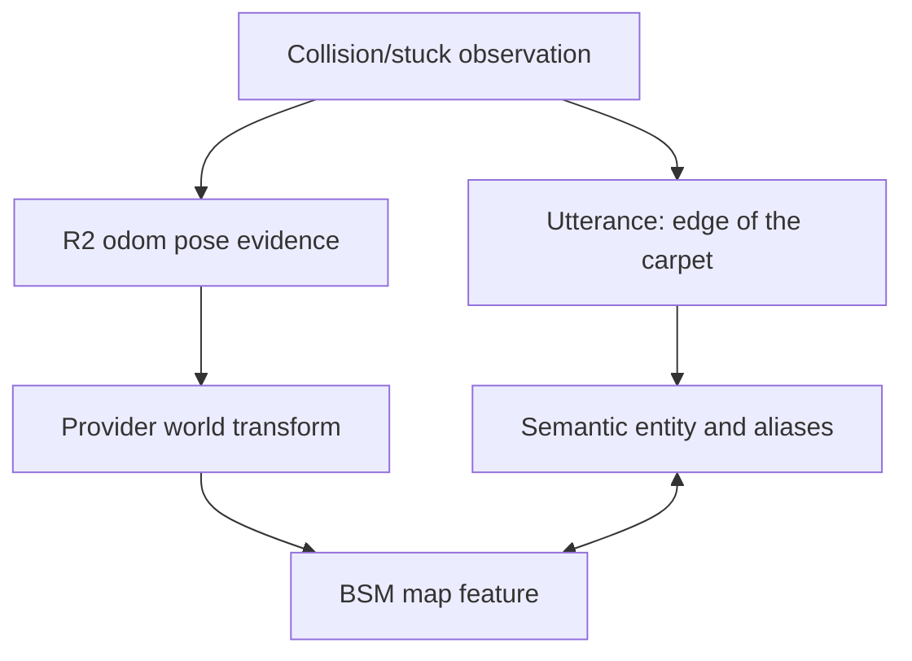

# 06 - Continuity and data specification

## 1. Objective

Continuity connects dialogue, semantic entities, actions, system events, and spatial evidence over time without merging the R2 and BSM databases. It must answer not only "what do we know?" but "why do we think that, when was it true, in which frame, and how confident are we?"

## 2. Ownership

### R2 Continuity owns

- dialogue sessions, utterances, summaries, and pending referents;
- commands, results, modes, expressions, and operational observations;
- semantic entities, aliases, tags, relationships, preferences, and notification history;
- local odometry-linked waypoints and encounter records;
- receipts/references for external map features and artifacts.

### BSM owns

- microphone/source/agent registrations;
- calibration and clock evidence;
- recordings, impulse responses, arrivals, and acoustic features;
- transform/trajectory estimates;
- map revisions, geometry, change hypotheses, and advisories;
- receipts/references for semantic entity IDs supplied by R2/operator.

Neither system writes the other's storage. Stable SAP IDs and hashes link evidence across the boundary.

## 3. Event-first model

Both products store append-only domain events before updating derived views. Events contain:

- event and aggregate/entity ID;
- type/schema version;
- producer, actor, session, correlation, causation;
- measurement and recorded times;
- clock quality;
- payload plus sensitivity/retention class;
- build/algorithm/config version;
- optional signature/hash chain for audit-critical sequences.

Derived tables can be rebuilt. Corrections append events; they do not rewrite history silently. Large binary content stays in artifact storage and is referenced by hash.

## 4. R2 MVP logical schema

| Table/view | Key content |
|---|---|
| `events` | append-only envelope and JSON payload |
| `commands` | command lifecycle, bounds, reason codes, result |
| `sessions` | conversation/operator/integration session state |
| `utterances` | transcript, speaker/zone, confidence, audio reference |
| `entities` | stable identity, type, canonical label, status |
| `aliases` | normalized/display alias, language, confidence |
| `claims` | subject-predicate-object/value, validity, provenance, confidence |
| `observations` | encounter/health/collision/stuck/attention evidence |
| `spatial_refs` | pose/frame/map feature/artifact links |
| `waypoints_routes` | local route versions and approval state |
| `notifications` | deduplication, priority, delivery receipt |
| `summaries` | versioned session/entity summaries with source event range |

SQLite with WAL mode is appropriate for single-Pi MVP. SQLAlchemy/Alembic migrations are required; application code does not rely on SQLite-specific semantics that block a future store adapter.

## 5. Entity model

Entities use stable opaque IDs and typed attributes. Initial types include:

- `person` (only when explicitly named/consented; no voice biometrics);
- `place`, `room`, `zone`, `waypoint`;
- `object`, `surface`, `edge`, `opening`, `hazard`;
- `agent`, `device`, `microphone_node`, `probe_source`;
- `route`, `mission`, `message`, `topic`.

Aliases preserve the user's natural phrases: "edge of the carpet," "carpet lip," and "where you got stuck" can refer to one entity. Merges and splits are reversible events with provenance.

## 6. Talk-to-Tag resolution

For every deictic phrase (`this`, `that`, `here`, `there`, `it`), create a candidate set containing:

- recent unresolved observations;
- currently selected UI entity;
- current/previous agent pose regions;
- active attention target;
- entities in the recent dialogue window;
- nearby map features from a fresh provider revision.

Each candidate score includes recency, spatial proximity, conversational salience, event-type match, provider confidence, and explicit user selection. Resolution policy:

- high confidence and clear margin: propose/commit and confirm naturally;
- medium/close candidates: ask a short disambiguation;
- low/no evidence: state that the referent cannot be grounded.

The stored claim retains the candidate scores and selected evidence. A later map revision may improve the spatial link without changing what the user said.

## 7. Example continuity chain

The connection between `E` and `F` is versioned and confidence-bearing. If BSM is absent, `E`, `C`, and `P` still exist.

## 8. Dialogue context

The reasoning dispatcher receives a bounded context package, not an unfiltered database dump:

- current session utterances within token/time limit;
- current mode/action/safety state;
- pending confirmation/referent;
- retrieved entity summaries and supporting claim IDs;
- fresh spatial facts with map revision/uncertainty;
- relevant preferences/quiet hours;
- explicit statement that external/email content is untrusted.

Long sessions are summarized with source event ranges. Summaries are derived, replaceable views; canonical claims and raw event references remain available subject to retention.

## 9. Spatial continuity

R2 stores local poses in `odom/<agent>`. A provider localization event supplies a time-bounded transform to `world`. Spatial references record:

- original pose and frame;
- transform chain/revision used for a world projection;
- projected pose/region and covariance;
- provider/map/evidence IDs;
- validity interval.

World positions are not baked irreversibly into semantic entities. Reprojection against a corrected map creates a new spatial-reference revision.

## 10. Identity exchange

R2 may submit a semantic entity ID/label as an annotation to BSM. BSM may return a feature ID. Both store the relationship but retain independent canonical records.

Cross-system deletion is explicit: one side emits a deletion/tombstone request with scope. The other applies its own retention/legal policy and returns a receipt; it does not grant direct deletion access.

## 11. Consistency and deduplication

- Event IDs and idempotency keys prevent duplicate effects.
- Consumers persist the event before advancing their cursor.
- Out-of-order events are buffered within a bounded window or stored as late evidence.
- Conflicting claims coexist with provenance until resolved; last-write-wins is not used for factual meaning.
- Health/current-state views may use latest-valid-by-measurement-time semantics.
- Arrival time is never used to overwrite a newer measurement silently.

## 12. Schema evolution

- Every event/claim/artifact metadata object has a schema version.
- Migrations are forward-only in production with a tested backup/restore path.
- Readers tolerate unknown additive fields.
- Derived views are rebuild-tested from event fixtures.
- Protocol types remain separate from database ORM types.
- A data export contains schema/version manifest and content hashes.

## 13. Search and retrieval

MVP retrieval combines:

- normalized alias/exact search;
- SQLite full-text search for transcripts/notes where enabled;
- typed/entity/relationship filters;
- temporal and spatial filters;
- optional embeddings behind an adapter.

Embeddings are never the only canonical representation and never substitute for exact IDs, provenance, or access control.

## 14. Backup and recovery

- Consistent SQLite backup while services are running, not raw file copy without coordination
- Artifact manifest and selected raw evidence backup
- Encrypted backup destination when sensitive data is included
- Restore drill in CI/integration lab using fixtures and periodically on the Pi
- Retention-aware pruning that does not leave dangling artifact links
- Database corruption/failure cannot make R2 move; continuity degrades visibly

## 15. User controls

The PWA must support viewing, renaming, merging, splitting, correcting, and deleting semantic entities/aliases; reviewing why a tag was resolved; viewing linked map evidence; and configuring retention. Corrections preserve history and mark superseded claims.

